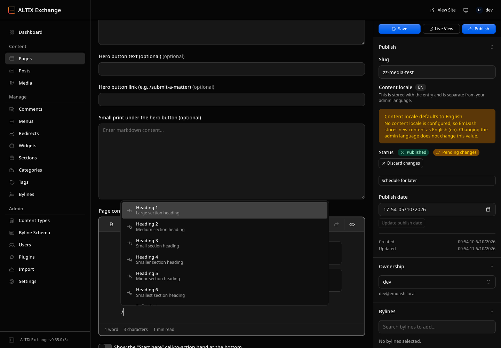
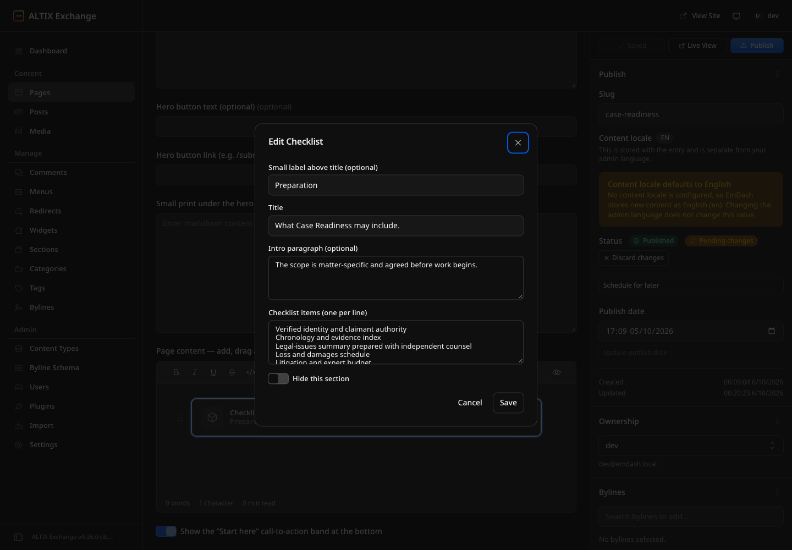
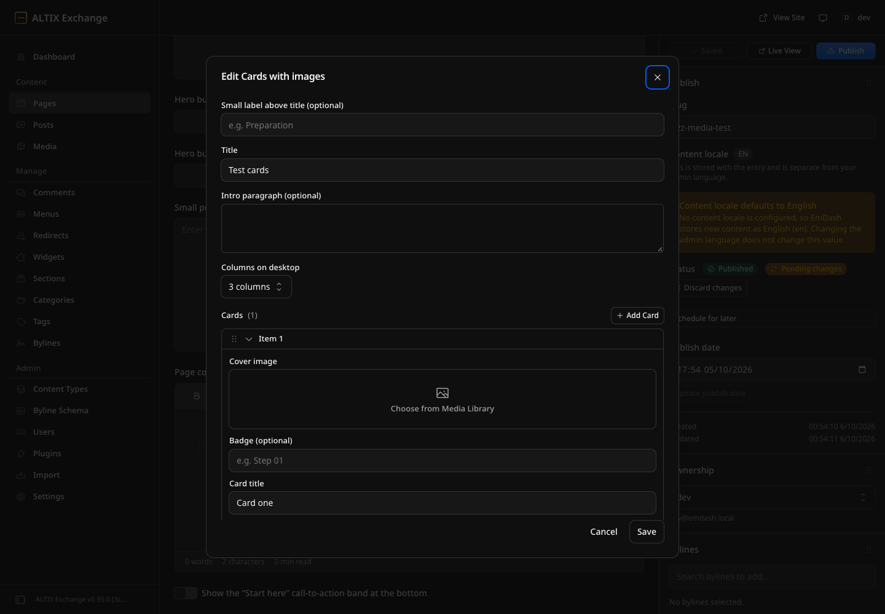

# Hướng dẫn biên tập website ALTIX (EmDash)

Tài liệu dành cho người biên tập nội dung — **không cần biết code, không cần viết JSON**.

---

## 1. Đăng nhập

1. Mở `https://altix.exchange/_emdash/admin`.
2. Đăng nhập bằng email được cấp.
3. Menu bên trái → **Pages** để xem tất cả các trang.

## 2. Cấu trúc một trang

Mỗi trang chỉ có vài ô cố định ở trên, phần còn lại là **các khối (block)** xếp chồng lên nhau:

| Ô | Ý nghĩa |
| --- | --- |
| **Title** | Tiêu đề lớn trên banner đầu trang |
| **Eyebrow** | Dòng chữ nhỏ phía trên tiêu đề |
| **Lead** | Đoạn mô tả ngắn dưới tiêu đề |
| **Hero button text / link** | Nút bấm trên banner (để trống = không có nút) |
| **Small print under the hero button** | Dòng chú thích nhỏ dưới nút |
| **Page content** | Nội dung chính — gồm văn bản, ảnh và các khối |
| **Show the "Start here" call-to-action band** | Bật/tắt dải kêu gọi hành động màu tối cuối trang |

Đường dẫn của trang (slug) nằm ở cột bên phải. **Trang mới tạo sẽ hiện ngay** tại `altix.exchange/<slug>`.

## 3. Làm việc với khối (block)

- **Thêm khối:** đặt con trỏ vào một dòng trống trong *Page content* → gõ `/` → chọn khối (gõ thêm chữ để lọc, ví dụ `/check` → *Checklist*).
- **Sửa khối:** bấm nút **Edit** (biểu tượng bút) trên khối → điền form → **Save**.
- **Kéo thả đổi thứ tự:** giữ biểu tượng ⋮⋮ bên trái khối và kéo lên/xuống.
- **Ẩn tạm thời:** mở Edit → bật **Hide this section**. Khối vẫn được giữ lại, chỉ không hiện trên web — tắt đi để hiện lại.
- **Xoá:** bấm biểu tượng thùng rác trên khối.

Mỗi ô trong form đều có nhãn tiếng Anh dễ hiểu và ví dụ mờ bên trong (placeholder). Những ô ghi **"one per line"** thì mỗi dòng là một mục.

### Các khối có sẵn

**Page sections** — dùng cho mọi trang

| Khối | Dùng khi |
| --- | --- |
| Intro | Nhãn nhỏ + tiêu đề + đoạn mở đầu. Đặt ngay trên đoạn văn để làm tiêu đề cho đoạn đó |
| Card grid | Lưới thẻ có tiêu đề, mô tả, link; tự đánh số 01, 02, 03… |
| Checklist | Danh sách gạch đầu dòng có dấu tick, 2 cột |
| Numbered steps | Quy trình từng bước, tự đánh số |
| FAQ | Câu hỏi bấm vào mới hiện câu trả lời |
| Form | Chèn một form có sẵn (liên hệ, gửi hồ sơ…) |
| Person | Ảnh, tên, chức danh, link hồ sơ |
| Callout | Hộp nhấn mạnh ghi chú quan trọng (đặt ngay dưới đoạn văn) |
| Notice | Thông báo khi chưa có nội dung |

**Homepage** — các khối của trang chủ: Homepage hero, Three service cards, Audience cards, Process timeline, Assessment criteria, Roadmap, Founder profile, Latest insights (tự lấy bài mới nhất, không cần điền), Call-to-action band.

**Images & media** — Image + text, Cards with images, Image gallery, Image carousel, Before / after slider.

> Trang chủ (*Home*) cũng là các khối — kéo thả để đổi thứ tự section, bật *Hide this section* để ẩn.

## 4. Chèn hình ảnh

Có 3 cách, tuỳ mục đích:

1. **Ảnh đơn giữa văn bản:** gõ `/image` → chọn ảnh trong Media Library (hoặc tải ảnh mới lên) → nhập *alt* (mô tả ảnh) và *caption* (chú thích) nếu muốn.
2. **Nhiều ảnh dạng lưới giữa văn bản:** gõ `/gallery` → chọn nhiều ảnh.
3. **Ảnh trong khối thiết kế sẵn** (Image + text, Cards with images, Gallery, Carousel, Before/after): mở Edit → bấm **Choose from Media Library** ở ô ảnh.

Mẹo:
- Luôn điền ô mô tả ảnh (*alt / Describe the image*) — tốt cho SEO và người khiếm thị.
- Ảnh nên ≤ 2 MB, định dạng JPG/WebP.
- Muốn quản lý tất cả ảnh: menu trái → **Media**.

## 5. Lưu, xuất bản, khôi phục

- **Save** — lưu bản nháp, website chưa thay đổi. Trạng thái hiện *Pending changes*.
- **Live View** — xem trước bản nháp trên giao diện thật.
- **Publish** — đưa thay đổi lên website.
- **Discard changes** — bỏ bản nháp, quay về bản đang chạy.
- **Schedule for later** — hẹn giờ xuất bản.
- Lịch sử chỉnh sửa (Revisions) ở cột phải cho phép khôi phục bản cũ.

## 6. Câu hỏi thường gặp

**Tôi lỡ xoá một khối?** Bấm *Discard changes* nếu chưa Publish, hoặc khôi phục từ Revisions.

**Tạo trang mới thế nào?** Pages → **New** → điền Title, slug → thêm khối → Publish. Sau đó thêm link vào menu ở **Menus** nếu cần.

**Nút trên dải CTA cuối trang dẫn đi đâu?** Mặc định đến nền tảng ALTIX. Muốn tuỳ biến, tắt dải mặc định và chèn khối *Call-to-action band* tự điền link.
