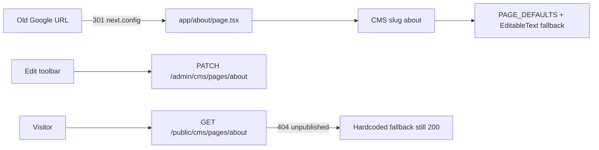

# Restore indexed marketing pages

> **Cancelled 2026-08-29.** Superseded by [`260829-0015-migrate-marketing-site-to-emdash`](../260829-0015-migrate-marketing-site-to-emdash/plan.md). IA routes, 301s, and sitemap ship on EmDash — do not expand `lix-api` `ALLOWED_PAGE_SLUGS`.

## Overview

`https://altix.exchange` is the Vercel Next.js app in `zealous-nobel`. After replacing WordPress/HubSpot, only `/` and `/insights` return 200. Header, footer, and homepage cards already link to ~20 routes that 404. Google still indexes old WordPress URLs.

**CMS v1.1 (locked 2026-08-28):** engineers still declare each route in Next.js. Copy is inline-editable through the existing Edit toolbar. Admin cannot invent new URLs. This is allowlist expansion, not a page builder.

Primary: `zealous-nobel` + `lix-api` (`PAGE_DEFAULTS` / `ALLOWED_PAGE_SLUGS`).  
Secondary: `lix-next` newsletter placeholders.  
Branch from `feat/marketing-cms-inline-edit`.

## Decisions (locked)

| Decision | Choice |
|---|---|
| Approach | New IA Next.js routes + 301 from Google/old URLs |
| CMS | v1.1 allowlist: one CMS slug per route, same Edit/publish flow as home |
| Page builder / admin-created paths | No |
| Old WordPress copy | Do not recreate; no “tokenize the claim” narrative |
| Legal pages | Temporary scaffold, CMS-editable, contact `info@altix.exchange`; do not invent policy |
| Newsroom | `/newsroom` 301 → `/insights`; drop footer Newsroom item |
| Marketplace | Do not change `platform.altix.exchange` |

## Goals

| # | Goal | Priority |
|---|------|----------|
| 1 | Every header, footer, and homepage-card href returns 200 | P1 |
| 2 | Google-indexed WordPress URLs 301 to the matching new path | P1 |
| 3 | Legal routes exist as scaffolds, not 404 | P1 |
| 4 | Admin can inline-edit and publish those pages without a code change for copy | P1 |
| 5 | `sitemap.xml` + `robots.txt` list the live public URLs | P1 |
| 6 | Newsletter templates no longer emit dead WordPress paths | P2 |

## Architecture



CMS v1 already patches only existing JSON paths (`set_by_path`). New pages must ship a **fixed schema** in `PAGE_DEFAULTS` so Edit works on first seed.

Shared inner-page schema (hubs, stages, audiences, company):

```json
{
  "eyebrow": "",
  "title": "",
  "lead": "",
  "sections": [
    { "title": "", "body": "" }
  ],
  "cta": ""
}
```

Leadership adds `photoUrl`, `name`, `role`. Legal uses `{ "title", "notice", "contact" }`.

`CmsProvider.pathnameToPageSlug` today only maps `/` → `home` and `/insights*` → `insights`. Extend that map for every new route. Public GET still 404s until first publish; `EditableText` fallbacks keep the page usable. Admin GET `/admin/cms/pages/{slug}` seeds the row from `PAGE_DEFAULTS`.

Redirects stay in `next.config.js`. CMS does not own URLs.

## CMS slug map

| URL | CMS slug |
|---|---|
| `/what-we-do` | `what-we-do` |
| `/how-it-works` | `how-it-works` |
| `/who-we-work-with` | `who-we-work-with` |
| `/expert-network` | `expert-network` |
| `/about` | `about` |
| `/about/leadership/elke-biechele` | `about-leadership` |
| `/case-readiness` | `case-readiness` |
| `/litigation-funding` | `litigation-funding` |
| `/case-administration` | `case-administration` |
| `/claimants-and-businesses` | `claimants-and-businesses` |
| `/law-firms` | `law-firms` |
| `/funding-participants` | `funding-participants` |
| `/forensic-experts` | `forensic-experts` |
| `/company-facts` | `company-facts` |
| `/privacy` | `privacy` |
| `/terms` | `terms` |
| `/cookies` | `cookies` |
| `/disclosures` | `disclosures` |
| `/security` | `security` |
| `/complaints` | `complaints` |

Slug column is `varchar(64)`; all of the above fit. Do not use Insights blog posts as stand-ins for these URLs.

## Redirect map

| Source | Destination |
|---|---|
| `/en-us`, `/en-us/` | `/` |
| `/about-us` | `/about` |
| `/how-altix-works` | `/how-it-works` |
| `/how-altix-works-for-claimants` | `/claimants-and-businesses` |
| `/how-altix-works-for-lawyers` | `/law-firms` |
| `/how-altix-works-for-investors` | `/funding-participants` |
| `/become-a-partner`, `/expert-panel` | `/expert-network` |
| `/contact-us` | `/` |
| `/altixblogs` | `/insights` |
| `/altixblogs/:slug` | `/insights/:slug` |
| `/privacy-policy` | `/privacy` |
| `/terms-of-service` | `/terms` |
| `/newsroom` | `/insights` |

## Non-goals

- Recreating WordPress/HubSpot pages at old slugs
- Admin UI to create/delete routes or change nav
- Free-form page builder / arbitrary HTML pages
- Full counsel-approved legal policies (scaffold only; editable later)
- A separate Newsroom product
- Changing `lix-next` marketplace routes

## Phases

| # | Phase | Status |
|---|-------|--------|
| 1 | [CMS allowlist + IA pages](./phase-01-start.md) | Pending |
| 2 | [Legal CMS scaffolds, redirects, sitemap](./phase-02-legal-scaffolds-redirects-sitemap.md) | Pending |
| 3 | [Outbound links and live verify](./phase-03-outbound-links-and-live-verify.md) | Pending |

## Success Criteria

- [ ] Every URL in the slug map returns HTTP 200 after deploy (fallback copy before first publish is OK)
- [ ] Logged-in ADMIN can Edit → change a field → Publish on `/about` (and the same shell on other IA pages)
- [ ] Every URL in the redirect map returns 301/308 then 200
- [ ] `/newsroom` lands on Insights; footer has one Insights link
- [ ] `/sitemap.xml` and `/robots.txt` are 200
- [ ] New newsletter HTML uses `/about`, `/how-it-works`, `/insights`, `/`
- [ ] No tokenization copy; no `POST /cms/pages` endpoint

## Risks

- **`set_by_path` cannot create keys.** `PAGE_DEFAULTS` must pre-create every editable path, including `sections[n]`.
- **Public CMS 404 until publish.** Frontend must keep fallbacks; do not block render on CMS.
- **Wrong repo / branch:** cook `zealous-nobel` + `lix-api` from `feat/marketing-cms-inline-edit`.
- **Blog slug mismatch** after `/altixblogs/:slug` 301 is acceptable if that Insights post was never migrated.

## Open questions

None.

<!-- slug: restore-indexed-marketing-pages -->
